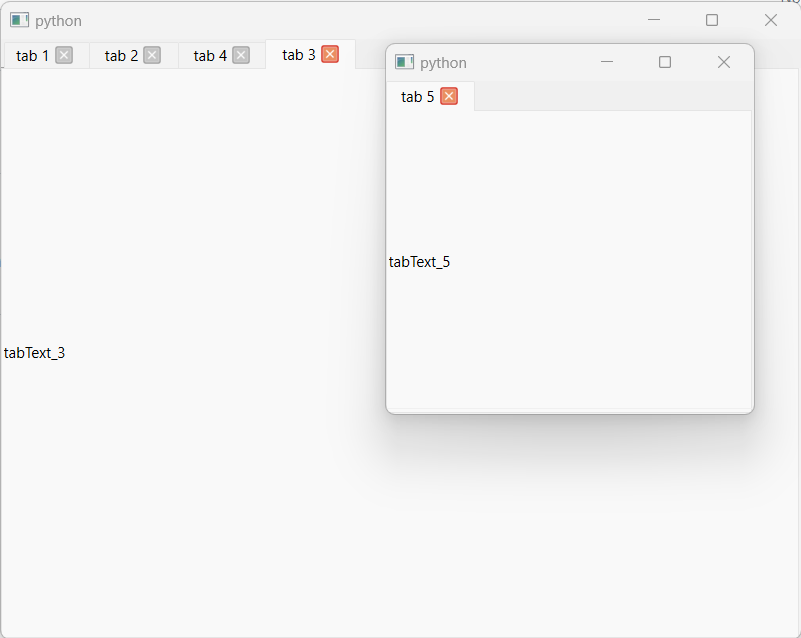

# qdetachabletabs
[qtabwidget-dragging-tabs](https://github.com/shishelmishel/qtabwidget-dragging-tabs)
ported to Python and Qt 6.

Allows to detach tabs as separate windows and re-attach them back.

